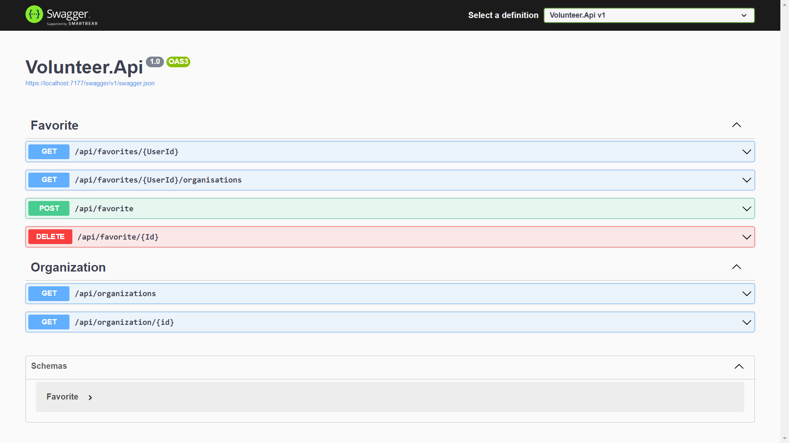

# Web application

## Front-end

For our front-end we use NextJs. NextJs is a React framework that allows us to build server-side rendered applications. It provides us with a simple, intuitive, and flexible framework for building our application's user interface. It also provides us with a robust set of tools for optimizing our application's performance and SEO, making it a natural choice for our project.

## Back-end

Our backend relies on ASP.NET Core Web API, chosen for its agility and high performance. We've structured it with a three-layer architecture: presentation, business logic, and data access. For database management, we use the Identity Framework, an ORM tool known for simplifying operations and bolstering security. This cohesive blend ensures efficient API development, clear code organization, and robust data handling, laying a solid foundation for our application's performance and scalability.

## Database

We SQL Server for our database. It is a robust, secure, and scalable database management system that provides us with a reliable foundation for our application. It is also compatible with the Identity Framework, which we use for user management, making it a natural choice for our project.

## Authentication

We use auth0 for authentication. Auth0 is a flexible, drop-in solution that handles authentication, authorization, and identity management for us. It provides a secure, reliable, and scalable platform for our application, allowing us to focus on building the best possible experience for our users.

