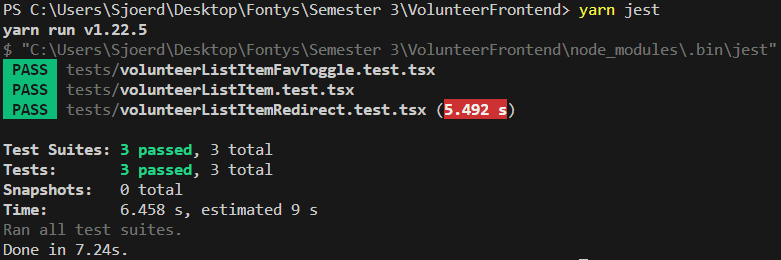
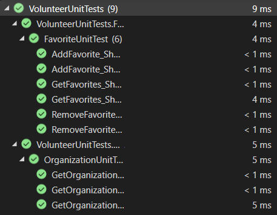
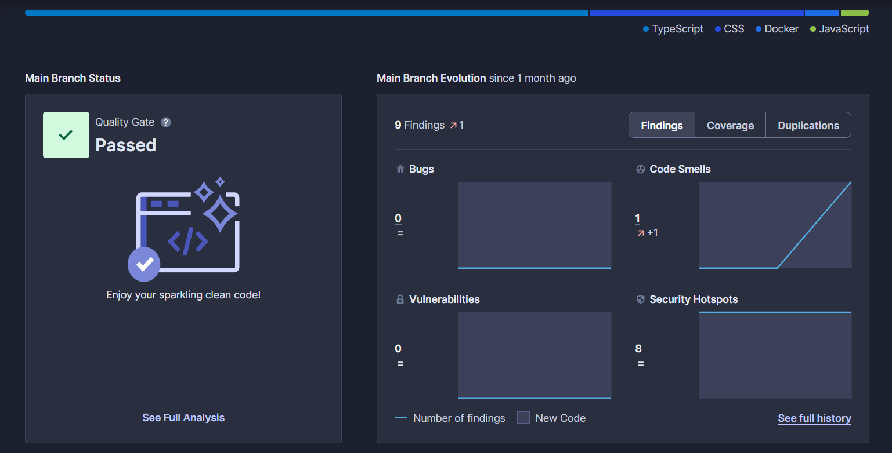

# Software quality

## Frontend testing

In our frontend development, we use jest to test functionality of our different components. These tests are important for making sure the application acts as expected.

## Backend testing

In our backend development, we use xUnit tests to thoroughly examine the functionality of our services. These tests are crucial for making sure our services work exactly as intended. We have two main types of test scenarios: the 'happy flow', which checks how things work under ideal conditions, and the 'bad flow', which looks at how the system deals with unexpected or wrong inputs and situations. Running these tests helps us carefully check different paths within our services, ensuring they work well in both good and tough situations.

## Code review

On GitHub, when you create a Pull Request, it needs to be reviewed by at least one other person before it can be merged. This review is essential to ensure that the code adheres to best practices, follows project guidelines, and functions correctly. While multiple reviews are beneficial for thoroughness, having at least one other reviewer helps validate the changes and maintain code quality before merging them into the main project.

## Code quality

SonarCloud serves as a critical component in our project's toolkit for maintaining high-quality code. Its seamless integration and continuous inspection of our codebase ensure that every line of code meets our quality standards before it gets merged. By flagging issues, vulnerabilities, and ensuring adherence to best practices, SonarCloud acts as a gatekeeper, preventing the inclusion of less-than-ideal code. Ultimately, it helps us deliver reliable and robust software while streamlining our development process.

