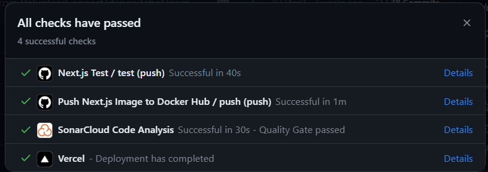
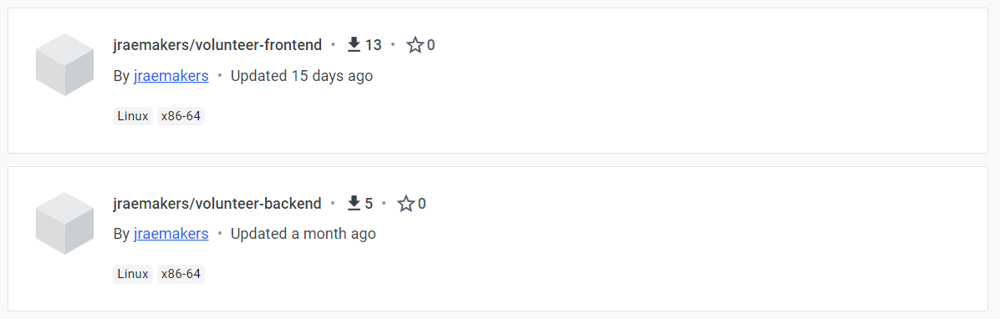
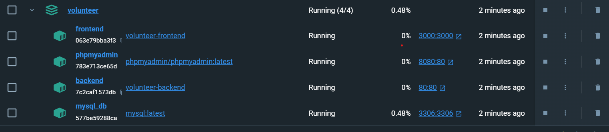

# CI/CD

## GitHub Actions

We use GitHub Actions to automate our CI/CD pipeline. We have two workflows, one for testing and one for building and pushing our Docker image to Docker Hub. The testing workflow runs on every push and pull request to the main branch. The build and push workflow runs on every push to the main branch. We also use [Vercel](https://volunteer-frontend-lemon.vercel.app) to deploy our frontend.

Here are the links to the workflows:

-   [Frontend Testing workflow](https://github.com/VolunteerConnect/VolunteerFrontend/blob/main/.github/workflows/test.yml)
-   [Frontend Build and push workflow](https://github.com/VolunteerConnect/VolunteerFrontend/blob/main/.github/workflows/main.yml)
-   [Backend Testing workflow](https://github.com/VolunteerConnect/Volunteer/blob/main/.github/workflows/test.yml)
-   [Backend Build and push workflow](https://github.com/VolunteerConnect/Volunteer/blob/main/.github/workflows/main.yml)

## Docker

We use Docker to containerize our application. This allows us to easily deploy our application to any environment that supports Docker. We use Docker Hub to store our Docker images. We have two Dockerfiles, one for our frontend and one for our backend.

Here are the links to the Dockerfiles and Docker Hub repositories:

-   [Frontend Dockerfile](https://github.com/VolunteerConnect/VolunteerFrontend/blob/main/Dockerfile)
-   [Backend Dockerfile](https://github.com/VolunteerConnect/Volunteer/blob/main/VolunteerBackend/Dockerfile)
-   [Frontend Docker Hub](https://hub.docker.com/r/jraemakers/volunteer-frontend)
-   [Backend Docker Hub](https://hub.docker.com/r/jraemakers/volunteer-backend)

## Docker Compose

We use Docker Compose to run our application locally. This allows us to easily run our application locally without having to install all the dependencies.

Here is the Docker Compose file:

[Docker Compose file](https://github.com/VolunteerConnect/Volunteer/blob/main/docker-compose.yml)
