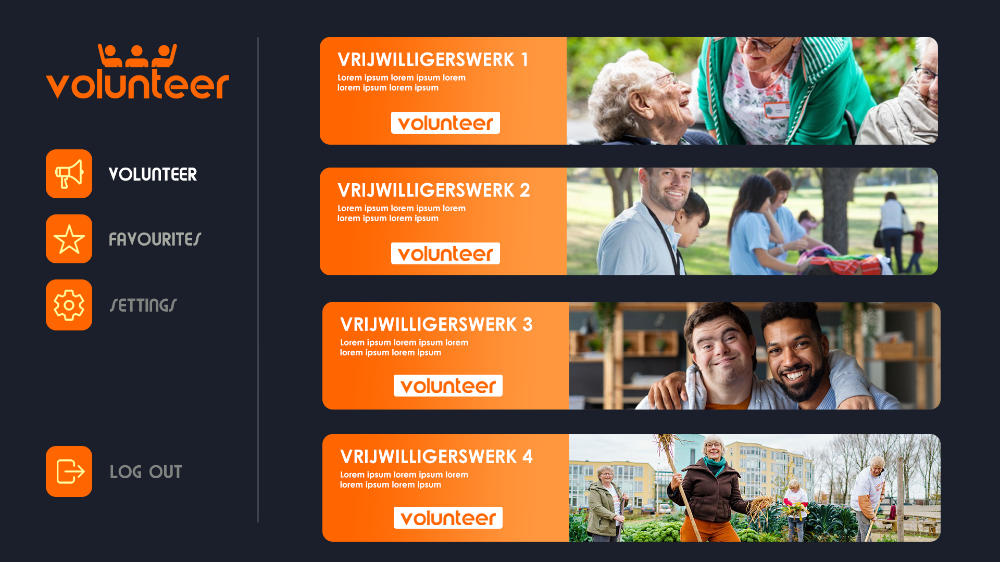
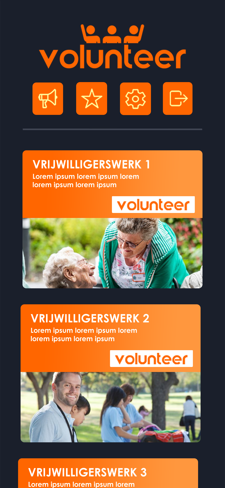
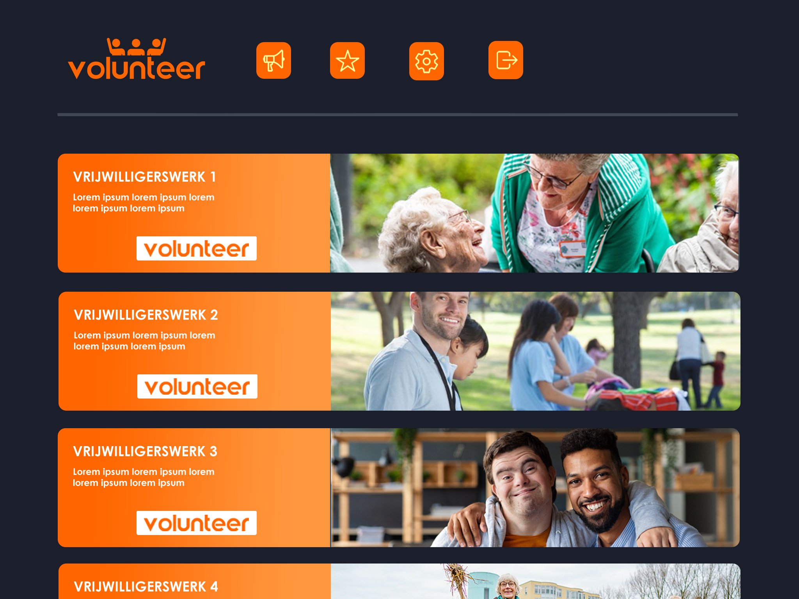
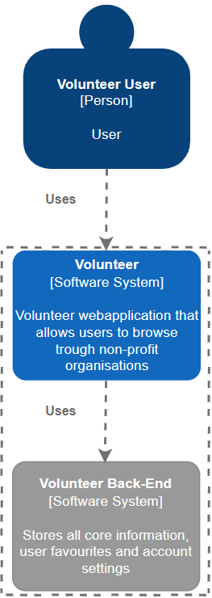
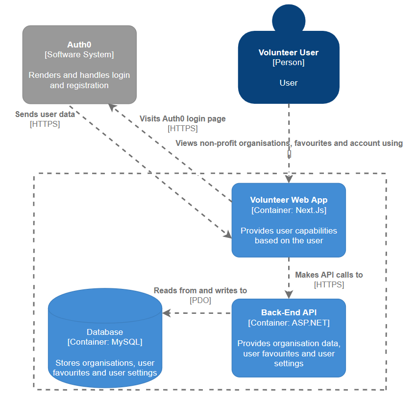

# Requirements and Designs

## Application Sketches/Designs

Before developing the application, sketches/designs were made for multiple devices for a better understanding of how the application would look visually:

### Desktop:

### Mobile:

### Tablet:

## C4 Model

These models provide a way to break down a system into different levels of abstraction, making it easier to understand, communicate, and document the architecture:

### Level 1:

### Level 2:

