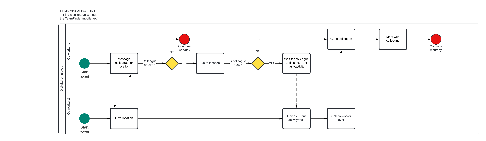
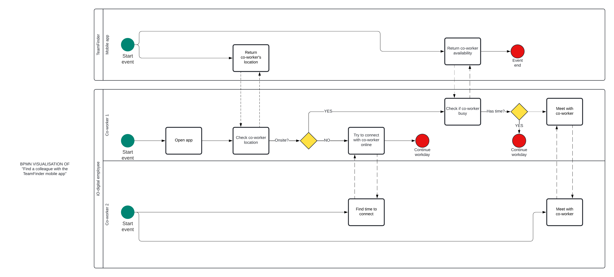

# Business processes

## Business process before the project

The business process before the project was inefficient, requiring employees to find each other by walking around the office and asking for the person they were looking for. This process took a lot of time and was problematic for those working from home, as they had no way of knowing the other person's location. Consequently, they had to call and inquire whether the person was at the office or working remotely. This issue created unnecessary challenges and disruptions for both in-office and remote employees.

## Business process after the project

The business process after the project is much more efficient, allowing employees to locate each other quickly and easily. This is achieved through a colleague tracking app that provides real-time information on whether a coworker is working at the office or remotely. When a colleague is at the office, it's crucial to determine their precise location, facilitating easy access for other team members. This location tracking can be achieved through methods like Wi-Fi signals or other innovative solutions.

