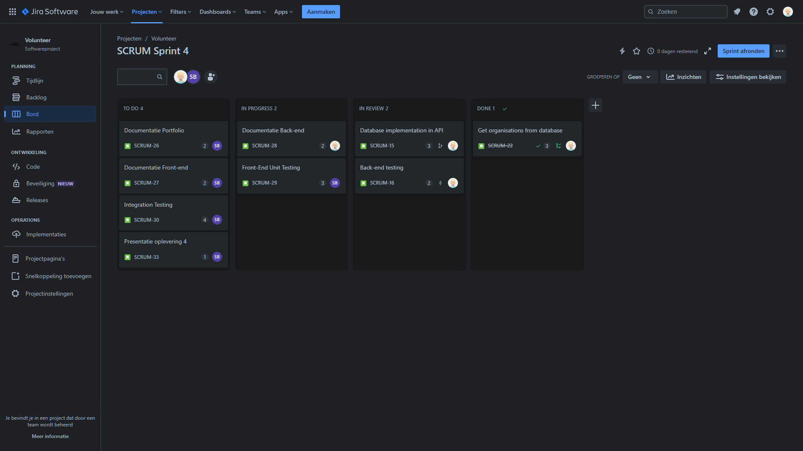

# Professional

## Jira

In this project we use Jira to manage our project. We use it to create user stories, tasks, and bugs. We also use it to track our progress and to keep track of what we have to do. Here is a screenshot of our Jira board:

## Definition of Done

-   [ ] Code follows coding standards and best practices.
-   [ ] All code related to the user story or feature is written and reviewed.
-   [ ] Code has been reviewed by at least one other team member for quality, correctness, and adherence to coding standards.
-   [ ] Any identified issues or improvements have been addressed.
-   [ ] The user story or feature has undergone user acceptance testing by stakeholders or users.
-   [ ] There are no known defects or critical issues related to the user story or feature.
-   [ ] The code is ready for deployment to the production environment.

## User Stories

### User Story 1

~~Als een potentiële vrijwilliger wil ik me kunnen aanmelden op het vrijwilligersplatform, zodat ik kan bijdragen aan non-profitorganisaties en hun hulpverzoeken kan bekijken.~~

As a potential volunteer, I want to see an overview of non-profit organizations so that I can choose which organization I want to assist.

#### Acceptance Criteria

-   I should see a list of 5 non-profit organizations with their names, brief descriptions and a picture or logo.
